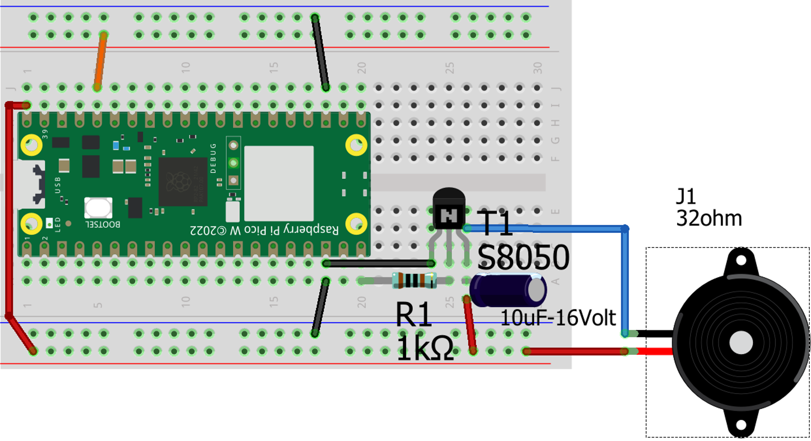

# CL13-uP: Sonido >draft<

Forma parte de la serie '**Workshop about Python and micropython with Pico W in CMM Benito**' Martin Madrid

## Clase 11 - Indice - 90 minutos

- Tutoriales, Programas, Conexionado y Librerias

- 0.Introducción al sonido en robotica

- [R] 1. Sonido básico 1 en Pico con PWM
  
  - Sonido solo buzzer: Activo / pasivo
  
  - Sonido : NPN+Altavoz & 1ros programas test

- [PyR] List comprehension y Diccionarios en Python

- [R] Sonido básico 2
  
  - Frecuencias de notas del piano
  
  - Canción Frère Jacques modo simple y con listas anidadas– 10’ + 20’

## Tutoriales y Programas que vamos a seguir

### Tutoriales resumen

De **Sunfounder** : 

Buzzer Activo

[3.1 Beep &mdash; SunFounder Kepler Kit for Raspberry Pi Pico W 1.0 documentation](https://docs.sunfounder.com/projects/kepler-kit/en/latest/pyproject/py_ac_buz.html)

Buzzer pasivo

[3.2 Custom Tone &mdash; SunFounder Kepler Kit for Raspberry Pi Pico W 1.0 documentation](https://docs.sunfounder.com/projects/kepler-kit/en/latest/pyproject/py_pa_buz.html#py-pa-buz)

----

### Tabla resumen de programas

| Programa                                                               | Lenguaje | Objetivo de Aprendizaje              | Hw adicional                             |
| ---------------------------------------------------------------------- | -------- | ------------------------------------ | ---------------------------------------- |
| [R2425CL13_buzzerActivo_1.py](R2425CL13_buzzerActivo_1.py)             | uPy      | uso basico buzzer Activo             | Buzzer activo                            |
| [R2425CL13_buzzerPas_in_freq_1.py](R2425CL13_buzzerPas_in_freq_1.py)   | uPy      | uso básico buzzer pasivo             | buzzer pasivo + transistor NPN en GPIO15 |
| [R2425_CL13_speaker_3notas_1_0.py](R2425_CL13_speaker_3notas_1_0.py)   | uPy      | uso básico altavoz (= buzzer pasivo) | altavoz + transistor NPN en GPIO15       |
| [P2425_CL13_list_compr_ex1.py](P2425_CL13_list_compr_ex1.py)           | Python   | Ejemplo 1 del pdf                    | ------                                   |
| [P2425_CL13_list_compr_ex1_1.py](P2425_CL13_list_compr_ex1_1.py)       | Python   | Ejemplo 1.1 del pdf                  |                                          |
| [P2425_CL13_list_compr_ex2.py](P2425_CL13_list_compr_ex2.py)           | Python   | Ejemplo 2 del pdf                    |                                          |
| [P2425_CL13_list_compr_ex2_1.py](P2425_CL13_list_compr_ex2_1.py)       | Python   | Ejemplo 2.1 del pdf                  |                                          |
| [R2425_CL13_speaker_in_note_2_0.py](R2425_CL13_speaker_in_note_2_0.py) |          |                                      |                                          |
| [R2425_CL13_speaker_FJac_3_0.py](R2425_CL13_speaker_FJac_3_0.py)       |          |                                      |                                          |
| [R2425_CL13_speaker_FJac_3_2.py](R2425_CL13_speaker_FJac_3_2.py)       |          |                                      |                                          |

### Conexionado

**Buzzer Activo**: solo se usa 1 vez

Pin + ---> 3.3 vol

Pin - --> GPIO 26

**Buzzer pasivo a GPIO 15**

### Libreria

No usaremos ninguna libreria.

NOTA : Hay algunos tutoriales de raspberry sobre sonido en Pico que usan una libreria llamada 'picozero'.  Creo personalmente, despues de estudiarlo, que la libreria complica cosas sencillas. Esta hecha con animo pedagógico para secundaria, pero no se si es contraproducente.

Link a [tutorial sound machine](https://projects.raspberrypi.org/en/projects/sound-machine)

## 0. Introducción al sonido en Robotica

Hay 2 aproximaciones al sonido en robotica con los controladores típicos ( arduinos, esp32, micro:bit o pico) y micropython:

1- **Generar el sonido produciendo ondas** con las que alimentar un zumbador o un altavoz

2- Usar el **protocolo [I2s ]([I²S - Wikipedia, la enciclopedia libre](https://es.wikipedia.org/wiki/I%C2%B2S))**

En esta clase iremos por el modo 1, y dentro de este por lo más simple que es usar el modo de PWM del pico para generar ondas cuadradas con un 50% de ciclo de trabajo, pero de distintas frecuencias lo que nos  dará la notas

---------------------

Para todo lo que sigue a partir de aqui usare el [pdf,](R2425_CL13_sonido_basico.pdf) salvo que se indique otra cosa

## [R] 1. Sonido básico 1 en Pico con PWM

### Consumo y uso de un transistor en modo corte-saturación

Según informacion en internet :

- **Buzzer Activo:** Generalmente consume alrededor de 30 mA. Por ejemplo, un buzzer activo de 5V puede consumir 30 mA. 
- **Buzzer Pasivo:** Puede consumir menos de 25 mA.

Los pines GPIO de la Raspberry Pi Pico ( a 3.3 volt) pueden dar un maximo de corriente de 25mA (miliamperios). No estan  diseñados para dar potencia

Vamos a comprobar con un polímetro nuestro caso

- **Buzzer Activo:** con bateria Lipo de 3.9 volt = 15 mA 
- **Buzzer Pasivo:** on bateria Lipo de 3.9 volt = **120 - 140  mA**

En el caso del buzzer pasivo que es el que nos interesa, vemos que necesitamos una solución que entregue mas potencia conservando el control ==> transistor (BJC) en modo corte-saturacion

Un buen tutorial para entender el uso de transistores BJC en modo corte-saturación es 

[Transistor bipolar BJT y Arduino](https://programarfacil.com/blog/arduino-blog/transistor-bipolar-bjt-npn/)

o leer el capitulo 'El transistor bipolar' del libro 'Electrónica para makers Guía completa' de Paolo Aliverti

**NO vamos a profundizar <u>en esta lección</u>, en como funciona un transistor en modo corte-saturación, solo diremos:**

> Transistor (BJC) : es como usar un interruptor controlado por un GPIO del microcontrolador PICO, que puede  abrir o cerrar circuitos con mucho consumo típicamente hasta 700 mA ( con los transistores usados S8050) y si es necesario mas voltaje que los 3.3vol, típicamente 5volt, 9volt o 12volt

Hay otras alternativas : rele, optoaclopador, ..pero son mas caras o complejas

Nota: El tuto de sunfounder sobre transistores NO es muy bueno

[Transistor &mdash; SunFounder Kepler Kit for Raspberry Pi Pico W 1.0 documentation](https://docs.sunfounder.com/projects/kepler-kit/en/latest/component/component_transistor.html)

### Sonido solo buzzer: Activo

[R2425CL13_buzzerActivo_1.py](R2425CL13_buzzerActivo_1.py)

no esta en pdf

### Sonido solo buzzer pasivo :  NPN+Altavoz & 1ros programas test

Seguir el [pdf](R2425_CL13_sonido_basico.pdf) 

Programas: 

[R2425CL13_buzzerPas_in_freq_1.py](R2425CL13_buzzerPas_in_freq_1.py)

[R2425_CL13_speaker_3notas_1_0.py](R2425_CL13_speaker_3notas_1_0.py)

## [PyR] List comprehension y Diccionarios en Python

Seguir el [pdf](R2425_CL13_sonido_basico.pdf)

Programas:

[P2425_CL13_list_compr_ex1.py](P2425_CL13_list_compr_ex1.py)

[P2425_CL13_list_compr_ex1_1.py](P2425_CL13_list_compr_ex1_1.py)

[P2425_CL13_list_compr_ex2.py](P2425_CL13_list_compr_ex2.py)

[P2425_CL13_list_compr_ex2_1.py](P2425_CL13_list_compr_ex2_1.py)

## [R] Sonido básico 2

### Frecuencias de notas del piano

Seguir el [pdf](R2425_CL13_sonido_basico.pdf)

Programas:

[R2425_CL13_speaker_in_note_2_0.py](R2425_CL13_speaker_in_note_2_0.py)

### Canción Frère Jacques modo simple y con listas anidadas

Seguir el [pdf](R2425_CL13_sonido_basico.pdf)

Programas:

[R2425_CL13_speaker_FJac_3_0.py](R2425_CL13_speaker_FJac_3_0.py)

[R2425_CL13_speaker_FJac_3_2.py](R2425_CL13_speaker_FJac_3_2.py)

## Preguntas sobre la Clase 13 - 10 minutos

Sección para que los alumnos pregunten sus dudas durante la clase

---

## TO DO :
